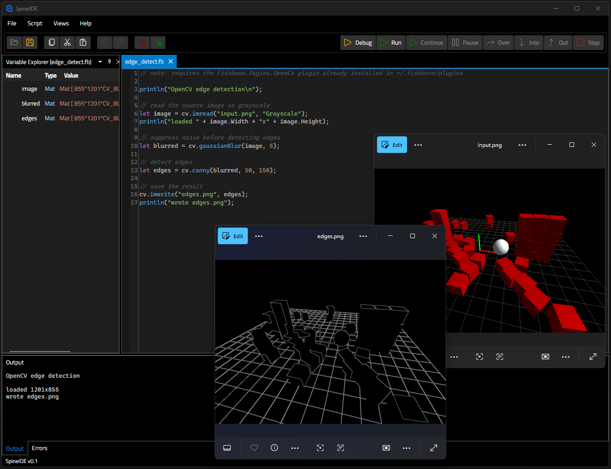

# Fishbone

**A small, debuggable scripting language designed for native .NET interop.**

Fishbone is a small scripting language that can interface with your
.NET types and objects. You can:

- Instantiate new objects via constructor call
- Call methods from those objects
- Call C# delegates as if they were simple functions
- Create Fishbone functions, loops, and more within the script

All Fishbone variables are underlying .NET objects and types by
design.


*(The included SpineIDE, which can be used to run and debug Fishbone scripts)*

Just inject existing objects or methods and call them naturally within
the script's environment:

```csharp
// parse the script once (can be reused, cache invalidation is yours to handle)
var program = FishboneProgram.ParseSource(scriptSource);

// configuration object used to set up the Fishbone environment
var config = new FishboneConfiguration();

// inject some C# objects
config.AddValue("image", currentImage);
config.AddBuiltIn("camera", myCamera);

// register a type which can be instantiated from within the script
config.AddType<Point>();

// create callable functions from C# via delegates
config.AddFunction("log", new Action<string>(Console.WriteLine));

// run
var env = program.Run(config);
```

Then you can use these within a Fishbone script:

```csharp
// sample.fb
let p = Point(3, 4);          // constructs a Point object
camera.Focus();               // calls a method from the built-in camera object
log("focused at " + p.X);     // calls the registered function
let w = image.Width;          // access fields/properties from objects
```

You can either run headless:

```csharp
var env = program.Run(config);   // returns the environment directly
```

or step through the code with SpineIDE (or any debug client that
supports DAP):

```csharp
var result = await program.RunDebuggableAsync(config, new FishboneDebugOptions
{
    OpenIde       = true, // launch SpineIDE and wait for it to attach
    AttachTimeout = TimeSpan.FromSeconds(10),
});
var env = result.Environment;
```

(will break at the first line until a debugger has connected to the
server).


See [docs/quickstart.md](docs/quickstart.md) for the full embedding guide.

---

## Why Fishbone

- **Native .NET interop.** Fishbone uses .NET types directly. A script
  calls methods, reads properties, indexes collections, and construct
  types as if it were C# because it is.
- **Step-debugging.** Fishbone uses DAP to allow users to set
  breakpoints, step through script lines and inspect the script's
  environment variables, whether attaching from SpineIDE or any DAP
  client.
- **Simple to set up.** The core engine has no heavy dependencies. The
  debugger lives in a separate package and you only reference it if
  you want it.

## What Fishbone is not

Fishbone is **not** trying to be Python or Lua for .NET, and it is not
a CLR language. It does not compile to MSIL or run on the DLR. It's a
deliberately small scripting layer whose runtime behavior is, by
design, mostly just .NET's.

---

## Plugins

A plugin packages reusable types, functions, and services so any
script can use them without the host wiring them up by hand. A plugin
is just a .NET class library that implements `IFishbonePlugin`.

All a plugin does is hook into an existing config and inject these new
types/values/builtins (same as just setting up a config normaly),
except that the `IFishbonePlugin` interface makes this "reusable and
shareable" intention explicit:

```csharp
using Fishbone.Engine;

public sealed class GeometryPlugin : IFishbonePlugin
{
    public void Register(FishboneConfiguration config)
    {
        config.AddType<Point>();
        config.AddFunction("distance", new Func<Point, Point, double>(Point.Distance));
    }
}
```

`Register` receives the same `FishboneConfiguration` you'd configure
by hand, so a plugin can do anything the host can: `AddType`,
`AddFunction`, `AddBuiltIn`, `AddValue`.

**Installing a plugin.** Build the class library (make sure you
PUBLISH it so all its dependencies are also packaged in the `publish/`
folder) and drop its output into a subfolder of the plugins directory:

```
~/.fishbone/plugins/
  GeometryPlugin/
    GeometryPlugin.dll
    <possibly other dependency .dlls>
```

SpineIDE, SpineCLI, and the DAP host each load every plugin from
`~/.fishbone/plugins` on startup: each immediate subfolder is scanned
for assemblies, and any `IFishbonePlugin` found is instantiated and
registered. Drop a plugin in, restart, and its API is available to
every script, no recompiling the host.

**Loading plugins in your own host.** If you embed Fishbone yourself,
load them wherever you like and inspect what was registered:

```csharp
var config = new FishboneConfiguration();
var loaded = FishbonePluginLoader.LoadPlugins(
    FishbonePluginLoader.DefaultPluginsDirectory, config);
```

> You could take a look at
> [Fishbone.Plugins.OpenCv](plugins/Fishbone.Plugins.OpenCv) for an
> example, it exposes a `Mat` type and image operations.

---

## Quick look at the syntax

```csharp
// variables, arithmetic, string concatenation
let name = "Fishbone";
let area = PI * pow(3, 2);
println("hello from " + name);

func add(a, b)
{
    return a + b;
}

for (i in 0, 5) // 0, 1, 2, 3, 4
{
    if (i % 2 == 0)
        println(i);
}

// using lists
let xs = [3, 1, 2];
foreach (x in xs) { println(x); }

// using maps
let user = {"name": "Ada", "id": 7};
println(user["name"]);

// everything is a C#/.NET object, so you can interface directly
let count = xs.Count;
```

A handful of built-ins come preconfigured: constants (`PI`, `E`), I/O
(`print`, `println`, `input`), math (`abs`, `round`, `min`, `max`,
`pow`, `sqrt`), and conversions (`int`, `double`, `string`). See the
[language specification](docs/fishbone-spec.md) for the full grammar
and semantics, and [samples/](samples/) for sample programs.

---

## Packages

| Package | Reference it for |
|---------|------------------|
| `Fishbone.Engine` | Parsing and running scripts, exposing your objects (minimal headless embedding surface) |
| `Fishbone.DebugAdapter` | `RunDebuggableAsync` and the DAP server for attaching a debugger. |

The remaining projects `Fishbone.Core`, `Fishbone.Parser`,
`Fishbone.Interpreter`, `Fishbone.Debugging` are just internal layers.

---

## Note

This project is in early stage and although no major breaking changes
are planned for now, I can't guarantee that syntax will remain the
same. (e.g. don't know if variable-list unpacking will remain, since
methods already support `out`).

---

## License

[MIT](LICENSE) © 2026 cenfraGit
