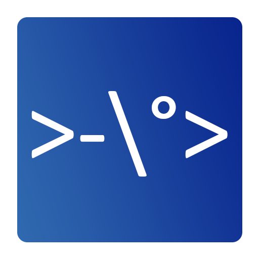
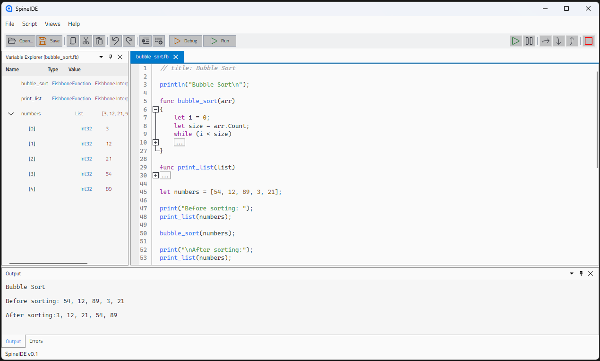
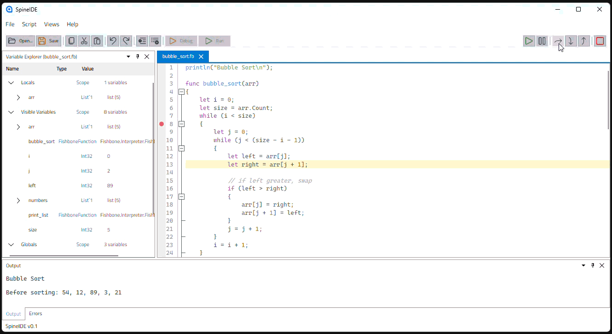

# <span style="display: inline-flex; align-items: center; gap: 10px;"> Fishbone</span>

[](https://github.com/cenfraGit/Fishbone/actions/workflows/ci.yml)

**A small, debuggable scripting language designed for .NET interop**

Fishbone is a simple scripting language that can interface with .NET types and objects. You can:

- Instantiate new objects via constructor call
- Call methods from those objects
- Call C# delegates as if they were simple functions
- Create functions, loops, and more within the script

All Fishbone variables are underlying .NET objects and types by design. Therefore, a script can call methods, read properties, index collections, etc. all as if it were C# (because it is).

```csharp
// sample.fb

let projectName = "Fishbone";
let projectVersion = 0.1;

let user = {"name": "Carter", "id": 0};
user.Add("location", "N.O.");
user["id"] = 17;

MyCSharpObject.Register(user);

func greeting(name) {
    return $"Hello {name}";
}

let success = MyCSharpObject.TryGetUserName(17, out userName);
if (success) {
    println($"{greeting(userName)} from {projectName} v{projectVersion}!");
}
```

See the [language specification](docs/fishbone-spec.md) for the full grammar and semantics, and [samples/](samples/) for sample programs.

## What Fishbone is not

Fishbone is **not** trying to be Python or Lua for .NET, and it is not an independent CLR language. It does not compile to MSIL or run on the DLR. It's a deliberately small scripting layer whose runtime behavior is, by design, mostly just .NET's.

## How to use?

1. Create a `FishboneConfiguration` object, injecting your C# types, objects and delegates:

```csharp
var config = new FishboneConfiguration();

// inject instances of your C# objects
config.AddValue("image", currentImage);
config.AddValue("camera", myCamera);

// register a type which can be instantiated from within the script
config.AddType<Point>();

// register a C# delegate which can be called from the script
config.AddBuiltIn("log", new Action<string>(Console.WriteLine));
```

2. Create your Fishbone script (in either a file or in a string):

```csharp
// sample.fb
let p = Point(3, 4);          // constructs a Point object
camera.Focus();               // calls a method from the camera object
log($"focused at {p.X}");     // calls the C# delegate
let w = image.Width;          // access fields/properties from objects
```

3. Create a FishboneProgram from the file path or from the source code string directly:

```csharp
var program = FishboneProgram.FromFile("sample.fb");
```

```csharp
var program = FishboneProgram.FromSourceCode("// here goes the code");
```

4. Run the script in either headless or in debug mode. Both give you access to the resulting `FishboneEnvironment` which has the variables table after execution.

```csharp
var env = program.Run(config);

env.GetValue("p");     // the Point object
env.GetValue("w");     // whatever image.Width was
env.GetValue("image"); // the injected "currentImage" variable
```

```csharp
var result = await program.RunDebuggableAsync(config, new FishboneDebugOptions
{
    OpenIde       = true, // launch SpineIDE and wait for it to attach
    AttachTimeout = TimeSpan.FromSeconds(10),
});

var env = result.Environment;
env.GetValue("p");     // the Point object
env.GetValue("w");     // whatever image.Width was
env.GetValue("image"); // the injected "currentImage" variable
```

(the `RunDebuggableAsync` path will break execution at the first line until a debugger attaches. If `OpenIde` is set to true, SpineIDE (see below) will be launched and it'll attach automatically to the debug server).

See [docs/quickstart.md](docs/quickstart.md) for the full embedding guide.

## SpineIDE

The cross-platform [SpineIDE](ide/SpineIDE/) app allows you to easily write, run and debug Fishbone programs. It can be used for standalone Fishbone development, or can be used to launch a debug session from your app automatically.



Fishbone uses DAP to allow users to set breakpoints, step through script lines and inspect the script's environment variables, whether attaching from SpineIDE or any DAP client.



---

## Plugins

A plugin packages reusable builtins, values, types, etc. so that any script can use them without the host having to wire them up by hand. A plugin consists of a .NET class that implements `IFishbonePlugin`.

All a plugin does is hook into an existing `FishboneConfiguration` and inject these builtins/values/types into that config. For example (taken directly from [Fishbone.Plugins.Math](plugins/Fishbone.Plugins.Math)):

```csharp
namespace Fishbone.Plugins.Math;

public sealed class MathPlugin : IFishbonePlugin
{
    public void Register(FishboneConfiguration config)
    {
        config.BuiltIns["PI"] = System.Math.PI;
        config.BuiltIns["E"] = System.Math.E;

        config.BuiltIns["abs"] = new Func<double, double>(System.Math.Abs);
        config.BuiltIns["round"] = new Func<double, int, double>(System.Math.Round);
        config.BuiltIns["min"] = new Func<double, double, double>(System.Math.Min);
        config.BuiltIns["max"] = new Func<double, double, double>(System.Math.Max);
        config.BuiltIns["pow"] = new Func<double, double, double>(System.Math.Pow);
        config.BuiltIns["sqrt"] = new Func<double, double>(System.Math.Sqrt);
    }
}
```

To use a plugin, all the host has to do is call `config.AddPlugin` when setting up the `FishboneConfiguration`:

```csharp
using Fishbone;
using Fishbone.Plugins.Math;

var config = new FishboneConfiguration();
config.AddPlugin(new MathPlugin());
```

---

[MIT](LICENSE) © 2026 cenfraGit

Fishbone Icon by [@aaronrzt](https://github.com/aaronrzt)  / [@aramireztaf](https://github.com/aramireztaf) 